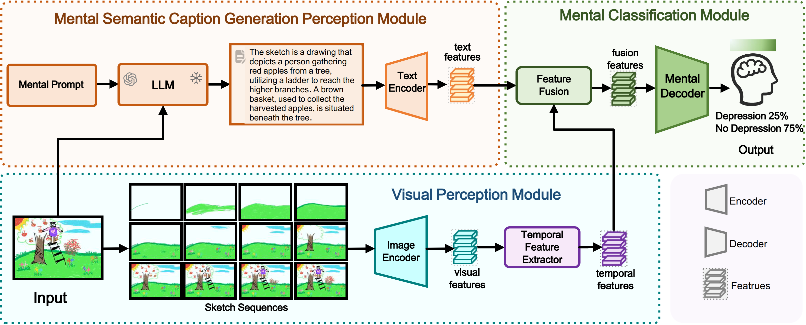
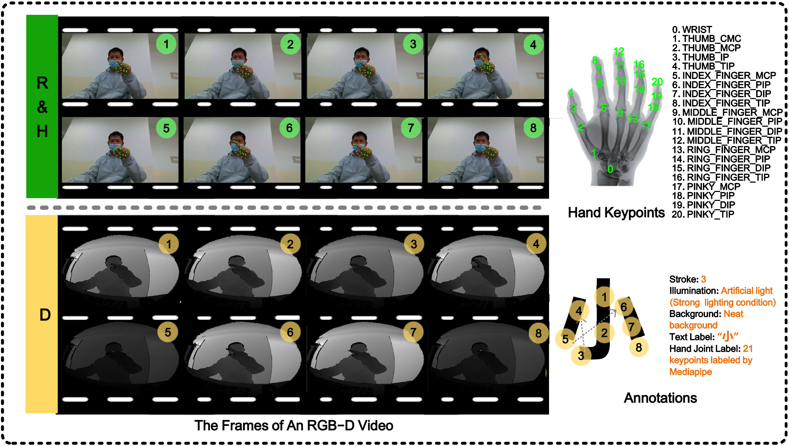








# 👨🏻‍💻 About

I am **Xuchen Li (李旭宸)**, a first-year Ph.D. student at **<a href="http://english.ia.cas.cn/">Institute of Automation, Chinese Academy of Sciences</a>** (CASIA ), supervised by **<a href="https://people.ucas.ac.cn/~huangkaiqi?language=en">Prof. Kaiqi Huang</a>** (IAPR Fellow). Additionally, I am a member of **<a href="http://viig.aitestunion.com/">Visual Intelligence Interest Group</a>** (VIIG ).

Before that, I received my B.E. degree in Computer Science and Technology at **<a href="https://scs.bupt.edu.cn/">School of Computer Science</a>** (SCS ) from **<a href="https://www.bupt.edu.cn/">Beijing University of Posts and Telecommunications</a>** (BUPT ) in Jun. 2024.

I am grateful to work with **<a href="https://huuuuusy.github.io/">Dr. Shiyu Hu</a>**, which has a significant impact on me. I am also grateful to be growing up and studying with my twin brother **<a href="https://xuzhaoli.github.io/">Xuzhao Li</a>**, which is a truly unique and special experience for me.

My research focuses on **Visual Language Tracking**, **Multi-modal Learning**, **Data-centric AI**, **Large Language Model** and **AI4Science**. If you are interested in my work or would like to collaborate, please feel free to contact me.

# 🔥 News
- **2024.06**: 📝 One [**paper**](https://xuchen-li.github.io/#VSLLM) has been accepted by **the 7th Chinese Conference on Pattern Recognition and Computer Vision** (PRCV, CCF-C Conference).
- **2024.06**: 👨‍🎓 Obtain my B.E. degree from **Beijing University of Posts and Telecommunications** (BUPT). I will always remember the wonderful 4 years I spent here. Thanks to all!
- **2024.05**: 🏆 Obtain **Beijing Outstanding Graduates (北京市优秀毕业生)** (Top 5%, only 38 students obtain this honor of SCS, BUPT)!
- **2024.05**: 📣 Present our work during **the 14th Vision and Learning Seminar** (VALSE), see our [**poster**](https://xuchen-li.github.io/files/VALSE-poster.pdf) for more information!
- **2024.04**: 📝 One [**paper**](https://xuchen-li.github.io/#DTLLM) has been accepted as **Oral Presentation** and awarded **Best Paper Honorable Mention Award** by **the 3rd CVPR Workshop on Vision Datasets Understanding** (CVPRW, Workshop in CCF-A Conference, Oral, Best Paper Honorable Mention Award)!
- **2023.12**: 🏆 Obtain **College Scholarship of University of Chinese Academy of Sciences (中国科学院大学大学生奖学金)** (only 17 students win this scholarship of CASIA)!
- **2023.12**: 🏆 Obtain **China National Scholarship (国家奖学金)** with a rank of **1/455 (0.22%)** (Top 1%, the highest honor for undergraduates in China)!
- **2023.11**: 🏆 Obtain **Beijing Merit Student (北京市三好学生)** (Top 1%, only 36 students obtain this honor of BUPT)!
- **2023.09**: 📝 One [**paper**](https://xuchen-li.github.io/#MGIT) has been accepted by **the 37th Conference on Neural Information Processing Systems** (NeurIPS, CCF-A Conference, Poster)!
- **2022.12**: 🏆 Obtain **Huawei AI Education Base Scholarship (华为智能基座奖学金)** (only 20 students win this scholarship of BUPT)!
- **2022.12**: 🏆 Obtain **China National Scholarship (国家奖学金)** with a rank of **2/430 (0.47%)** (Top 1%, the highest honor for undergraduates in China)!

# 📖 Educations

2024.09 - 2029.06 (Expected), Ph.D. student 
Pattern Recognition and Intelligent System 
Institute of Automation, Chinese Academy of Sciences, Beijing

2020.09 - 2024.06, B.E. degree 
Computer Science and Technology, Overall Ranking <b>1/449 (0.22%)</b> 
School of Computer Science 
Beijing University of Posts and Telecommunications, Beijing

# 💻 Experiences
* **2024.06 - now**: Research intern on multi-modal large language model at **<a href="https://www.antgroup.com/en">Ant Group</a>** (ANT ), advised by **[Dr. Jian Wang](https://scholar.google.com/citations?hl=en-US&user=gz_hWPoAAAAJ)** and **[Dr. Ming Yang](https://scholar.google.com/citations?hl=en-US&user=uBHJx08AAAAJ)**.
* **2023.05 - 2024.04**: Member of Artificial Intelligence Elites Class at **[Institute of Automation, Chinese Academy of Sciences](http://english.ia.cas.cn/)** (CASIA ), supervised by **<a href="https://people.ucas.ac.cn/~huangkaiqi?language=en">Prof. Kaiqi Huang</a>** (IAPR Fellow).
* **2023.01 - 2023.05**: Research intern on 3D vision at **[Tsinghua University](https://www.tsinghua.edu.cn/en/)** (THU ),  advised by **[Prof. Haoqian Wang](https://scholar.google.com/citations?hl=en-US&user=eldgnIYAAAAJ)**.

# 📝 Publications 

## ✅ Acceptance

CVPRW 2024

**DTLLM-VLT: Diverse Text Generation for Visual Language Tracking Based on LLM**

***Xuchen Li***, [Xiaokun Feng](https://xiaokunfeng.github.io/), [Shiyu Hu](https://huuuuusy.github.io/), [Meiqi Wu](https://wmeiqi.github.io/), [Dailing Zhang](https://zhangdailing8.github.io/), Jing Zhang, [Kaiqi Huang](https://people.ucas.ac.cn/~huangkaiqi?language=en)

CVPRW 2024 (Workshop in CCF-A Conference, Oral, Best Paper Honorable Mention Award): **[the 3rd CVPR Workshop on Vision Datasets Understanding](https://sites.google.com/view/vdu-cvpr24/)** 
  [[**Paper**](https://openaccess.thecvf.com/content/CVPR2024W/VDU/html/Li_DTLLM-VLT_Diverse_Text_Generation_for_Visual_Language_Tracking_Based_on_CVPRW_2024_paper.html)]
  [[**PDF**](https://xuchen-li.github.io/files/DTLLM.pdf)]
  [[**Code**](https://github.com/Xuchen-Li/DTLLM-VLT)]
  [[**Website**](http://videocube.aitestunion.com/)]
  [[**Award**](https://xuchen-li.github.io/files/DTLLM-award.pdf)]
  [[**Poster**](https://xuchen-li.github.io/files/DTLLM-poster.pdf)]
  [[**Slides**](https://xuchen-li.github.io/files/DTLLM-slides.pdf)]
  [[**BibTeX**](https://xuchen-li.github.io/files/DTLLM.bib)] 
📌 Visual Language Tracking  📌 LLM  📌 Evaluation Technique

NeurIPS 2023

**A Multi-modal Global Instance Tracking Benchmark (MGIT): Better Locating Target in Complex Spatio-temporal and Causal Relationship**

[Shiyu Hu](https://huuuuusy.github.io/), [Dailing Zhang](https://zhangdailing8.github.io/), [Meiqi Wu](https://wmeiqi.github.io/), [Xiaokun Feng](https://xiaokunfeng.github.io/), ***Xuchen Li***, [Xin Zhao](https://www.xinzhaoai.com/), [Kaiqi Huang](https://people.ucas.ac.cn/~huangkaiqi?language=en)

NeurIPS 2023 (CCF-A Conference, Poster): **[the 37th Conference on Neural Information Processing Systems](https://neurips.cc/Conferences/2023)** 
  [[**Paper**](https://proceedings.neurips.cc/paper_files/paper/2023/hash/4ea14e6090343523ddcd5d3ca449695f-Abstract-Datasets_and_Benchmarks.html)]
  [[**PDF**](https://xuchen-li.github.io/files/MGIT.pdf)]
  [[**Code**](https://github.com/huuuuusy/videocube-toolkit)]
  [[**Website**](http://videocube.aitestunion.com/)]
  [[**Poster**](https://xuchen-li.github.io/files/MGIT-poster.pdf)]
  [[**Slides**](https://xuchen-li.github.io/files/MGIT-slides.pdf)]
  [[**BibTeX**](https://xuchen-li.github.io/files/MGIT.bib)] 
📌 Visual Language Tracking  📌 Video Understanding  📌 Hierarchical Annotation

PRCV 2024

**VS-LLM: Visual-Semantic Depression Assessment based on LLM for Drawing Projection Test**

[Meiqi Wu](https://wmeiqi.github.io/), Yaxuan Kang, ***Xuchen Li***, [Shiyu Hu](https://huuuuusy.github.io/), [Xiaotang Chen](http://www.crise.ia.ac.cn/teachers_view.aspx?TypeId=141&Id=467&Fid=t26:141:26), [Yunfeng Kang](http://www.crise.ia.ac.cn/teachers_view.aspx?TypeId=141&Id=495&Fid=t26:141:26), [Weiqiang Wang](https://people.ucas.edu.cn/~wqwang?language=en), [Kaiqi Huang](https://people.ucas.ac.cn/~huangkaiqi?language=en)

PRCV 2024 (CCF-C Conference): **[the 7th Chinese Conference on Pattern Recognition and Computer Vision](https://www.prcv.cn/)** 
  [[**PDF**](https://xuchen-li.github.io/files/VSLLM.pdf)]
  [[**Code**](https://github.com/wmeiqi/VS-LLM)] 
📌 Psychological Assessment  📌 LLM  📌 AI4Science

## ☑️ Ongoing

CCF-A

**DTVLT: A Multi-modal Diverse Text Benchmark for Visual Language Tracking Based on LLM**

***Xuchen Li***, [Shiyu Hu](https://huuuuusy.github.io/), [Xiaokun Feng](https://xiaokunfeng.github.io/), [Dailing Zhang](https://zhangdailing8.github.io/), [Meiqi Wu](https://wmeiqi.github.io/), Jing Zhang, [Kaiqi Huang](https://people.ucas.ac.cn/~huangkaiqi?language=en)

Submitted to a CCF-A conference, Under Review 
📌 Visual Language Tracking  📌 LLM  📌 Benchmark Construction

CCF-A

**MemVLT: Visual-Language Tracking with Adaptive Memory-based Prompts**

[Xiaokun Feng](https://xiaokunfeng.github.io/), ***Xuchen Li***, [Shiyu Hu](https://huuuuusy.github.io/), [Dailing Zhang](https://zhangdailing8.github.io/), [Meiqi Wu](https://wmeiqi.github.io/), Jing Zhang, [Xiaotang Chen](http://www.crise.ia.ac.cn/teachers_view.aspx?TypeId=141&Id=467&Fid=t26:141:26), [Kaiqi Huang](https://people.ucas.ac.cn/~huangkaiqi?language=en)

Submitted to a CCF-A conference, Under Review 
📌 Visual Language Tracking  📌 Human-like Modeling  📌 Adaptive Prompts

CCF-A

**Unconstrained Multimodal Air-Writing Benchmark: Writing by Moving Your Fingers in 3D**

[Meiqi Wu](https://wmeiqi.github.io/), ***Xuchen Li***, [Shiyu Hu](https://huuuuusy.github.io/), [Yuanqiang Cai](https://scholar.google.com/citations?hl=en-US&user=VHegyzQAAAAJ), [Kaiqi Huang](https://people.ucas.ac.cn/~huangkaiqi?language=en), [Weiqiang Wang](https://people.ucas.edu.cn/~wqwang?language=en)

Submitted to a CCF-A conference, Under Review 
📌 Air Writing  📌 Benchmark Construction  📌 Human-machine Interaction

CCF-A

**Beyond Accuracy: Tracking more like Human through Visual Search**

[Dailing Zhang](https://zhangdailing8.github.io/), [Shiyu Hu](https://huuuuusy.github.io/), [Xiaokun Feng](https://xiaokunfeng.github.io/), ***Xuchen Li***, [Meiqi Wu](https://wmeiqi.github.io/), Jing Zhang,  [Kaiqi Huang](https://people.ucas.ac.cn/~huangkaiqi?language=en)

Submitted to a CCF-A conference, Under Review 
📌 Visual Object Tracking  📌 Visual Search Mechanism  📌 Visual Turing Test

# 🏆 Honors

* **Best Paper Honorable Mention Award (最佳论文荣誉提名奖)**, at the 3rd CVPR Workshop on Vision Datasets Understanding, 2024
* **China National Scholarship (国家奖学金)**, My Rank: 1/455 (0.22%), Top 1%, at BUPT, by Ministry of Education of China, 2023
* **China National Scholarship (国家奖学金)**, My Rank: 2/430 (0.47%), Top 1%, at BUPT, by Ministry of Education of China, 2022
* **Huawei AI Education Base Scholarship (华为智能基座奖学金)**, at BUPT, by Ministry of Education of China and Huawei AI Education Base Joint Working Group, 2022
* **Beijing Merit Student (北京市三好学生)**, Top 1%, at BUPT, by Beijing Municipal Education Commission, 2023
* **Beijing Outstanding Graduates (北京市优秀毕业生)**, Top 5%, at BUPT, by Beijing Municipal Education Commission, 2024
* **College Scholarship of University of Chinese Academy of Sciences (中国科学院大学大学生奖学金)**, at CASIA, by University of Chinese Academy of Sciences, 2023

# 🔗 Services

* **Reviewer**: ICPR 2024

# 🌟 Projects

GOT-10k Platform

**<a href="http://got-10k.aitestunion.com/">GOT-10k: A Large High-diversity Benchmark and Evaluation Platform for Single Object Tracking</a>**
- Visual Object Tracking / Evaluation Technology / Large High-diversity Benchmark
- As of June 2024, the platform has received 3.66M+ page views, 7.2k+ downloads, 20.5k+ trackers from 160+ countries and regions worldwide.
- GOT-10k is the supporting platform for research accepted by IEEE TPAMI 2021.

VideoCube / MGIT Platform

**<a href="http://videocube.aitestunion.com/">VideoCube / MGIT: A Large-scale Multi-dimensional Multi-modal Global Instance Tracking Intelligent Evaluation Platform</a>** 
- Visual Object Tracking / Visual Language Tracking / Long Video Understanding and Reasoning / Intelligent Evaluation Technology
- As of June 2024, the platform has received 389k+ page views, 1.1k+ downloads, 410+ trackers from 130+ countries and regions worldwide.
- VideoCube / MGIT is the supporting platform for research accepted by IEEE TPAMI 2023 and NeurIPS 2023.

SOTVerse Platform

**<a href="http://metaverse.aitestunion.com/">SOTVerse: A User-defined Single Object Tracking Task Space</a>**
- Visual Object Tracking / Dynamic Open Environment Construction / Visual Evaluation Technique
- As of June 2024, the platform has received 120k+ page views from 100+ countries and regions worldwide.
- SOTVerse is the supporting platform for research accepted by IJCV 2023.

# 🤝 Collaborators

- [**Shiyu Hu**](https://huuuuusy.github.io/), Ph.D. at the [**Institute of Automation, Chinese Academy of Sciences**](http://english.ia.cas.cn/) (CASIA ) and [**University of Chinese Academy of Sciences**](https://english.ucas.ac.cn/) (UCAS ), focusing on visual object tracking, visual language tracking, benchmark construction, intelligent evaluation technique, and AI4Science.
- [**Xiaokun Feng**](https://xiaokunfeng.github.io/), Ph.D. student at the [**Institute of Automation, Chinese Academy of Sciences**](http://english.ia.cas.cn/) (CASIA ), focusing on visual object tracking, visual language tracking, and AI4Science.
- [**Dailing Zhang**](https://zhangdailing8.github.io/), Ph.D. student at the [**Institute of Automation, Chinese Academy of Sciences**](http://english.ia.cas.cn/) (CASIA ), focusing on visual object tracking, visual language tracking, and AI4Science.
- [**Meiqi Wu**](https://wmeiqi.github.io/), Ph.D. student at the [**University of Chinese Academy of Sciences**](https://english.ucas.ac.cn/) (UCAS ), focusing on computer vision, intelligent evaluation technique, and human-computer interaction.
- [**Xuzhao Li**](https://xuzhaoli.github.io/), M.S. student at [**Beijing Institute of Technology**](https://english.bit.edu.cn/) (BIT ), focusing on multi-agent path planning and trajectory prediction.
- **Jing Zhang**, research assistant at the [**Institute of Automation, Chinese Academy of Sciences**](http://english.ia.cas.cn/) (CASIA ), focusing on computer vision and AI4Science.
- **Yaxuan Kang**, design researcher, research assistant and interaction designer at the [**Institute of Automation, Chinese Academy of Sciences**](http://english.ia.cas.cn/) (CASIA ), focusing on human-computer interaction.

My homepage visitors have been recorded since February 2024. Thanks for your attention.
<body>

</body>

  

    
         &copy; Xuchen Li | Last updated: Jul. 2024
    
  

