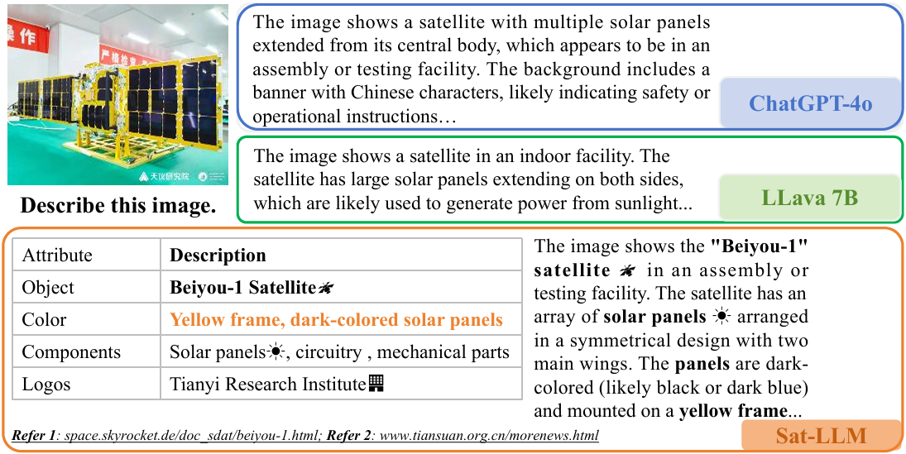








# 👨🏻‍💻 About

I am **Xuchen Li (李旭宸)**, a first-year Ph.D. student at **<a href="http://bjzgca.bjedu.cn:81/">Beijing Zhongguancun Academy</a>**, supervised by **<a href="https://web.math.princeton.edu/~weinan/">Prof. Weinan E</a>** (Academician of CAS), **<a href="http://faculty.bicmr.pku.edu.cn/~dongbin/">Prof. Bing Dong</a>** (Professor at PKU) and **<a href="https://zwt233.github.io/">Prof. Wentao Zhang</a>** (Professor at PKU) and **<a href="http://english.ia.cas.cn/">Institute of Automation, Chinese Academy of Sciences</a>**, supervised by **<a href="https://people.ucas.ac.cn/~huangkaiqi?language=en">Prof. Kaiqi Huang</a>** (Professor at CASIA).

Before that, I received my B.E. degree in Computer Science and Technology with overall ranking <b>1/449 (0.22%)</b> at **<a href="https://scs.bupt.edu.cn/">School of Computer Science</a>** from **<a href="https://www.bupt.edu.cn/">Beijing University of Posts and Telecommunications</a>** in Jun. 2024. During my time there, I was awarded **China National Scholarship** twice. Thank you to everyone for their support.

I am grateful to be growing up and studying with my twin brother **<a href="https://xuzhaoli.github.io/">Xuzhao Li</a>** (M.S. Student at BIT), which is a truly unique and special experience for me. I am also proud to collaborate with **<a href="https://huuuuusy.github.io/">Dr. Shiyu Hu</a>** (Research Fellow at NTU), which has a significant impact on me.

My research focuses on **Multi-modal Learning**, **Large Language Model** and **Data-centric AI**. If you are interested in my work or would like to collaborate, please feel free to contact me.

# 🔥 News

- **2024.12**: 📠<b>1 paper</b> has been accepted by <b>the 50th International Conference on Acoustics, Speech, and Signal Processing</b> (ICASSP, CCF-B Conference)!

- **2024.11**: 🆠Obtain <b>Top Ten Classes of University of Chinese Academy of Sciences (中国科学院大学十佳班集体)</b> as <b>Monitor</b> (only 10 classes obtain this honor of UCAS)!

- **2024.09**: 📠<b>2 papers</b> have been accepted by <b>the 38th Conference on Neural Information Processing Systems</b> (NeurIPS, CCF-A Conference)!

- **2024.08**: 📣 Start my Ph.D. life at <b>University of Chinese Academy of Sciences</b> (UCAS), which is located in Huairou District, Beijing, near the beautiful Yanqi Lake.

- **2024.06**: 👨‍🎓 Obtain my B.E. degree from <b>Beijing University of Posts and Telecommunications</b> (BUPT). I will always remember the wonderful 4 years I spent here. Thanks to all!

- 
 
More

  <ul>
    <li><b>2024.06:</b> 📠<b>1 paper</b> has been accepted by <b>the 7th Chinese Conference on Pattern Recognition and Computer Vision</b> (PRCV, CCF-C Conference)!</li>
    <li><b>2024.05:</b> 🆠Obtain <b>Beijing Outstanding Graduates (北京市优秀毕业生)</b> (Top 5%, only 38 students obtain this honor of SCS, BUPT)!</li>
    <li><b>2024.04:</b> 📠<b>1 paper</b> has been accepted as <b>Oral Presentation</b> and awarded <b>Best Paper Honorable Mention Award</b> by <b>the 3rd CVPR Workshop on Vision Datasets Understanding</b> (CVPRW, CCF-A Conference Workshop, Oral Presentation, Best Paper Honorable Mention Award)!</li>
    <li><b>2023.12:</b> 🆠Obtain <b>College Scholarship of University of Chinese Academy of Sciences (中国科学院大学大学生奖学金)</b> (only 17 students win this scholarship of CASIA)!</li>
    <li><b>2023.12:</b> 🆠Obtain <b>China National Scholarship (国家奖学金)</b> with a rank of <b>1/455 (0.22%)</b> (Top 1%, the highest honor for undergraduates in China)!</li>
    <li><b>2023.11:</b> 🆠Obtain <b>Beijing Merit Student (北京市三好学生)</b> (Top 1%, only 36 students obtain this honor of BUPT)!</li>
    <li><b>2023.09:</b> 📠<b>1 paper</b> has been accepted by <b>the 37th Conference on Neural Information Processing Systems</b> (NeurIPS, CCF-A Conference)!</li>
    <li><b>2022.12:</b> 🆠Obtain <b>Huawei AI Education Base Scholarship (华为智能基座奖学金)</b> (only 20 students win this scholarship of BUPT)!</li>
    <li><b>2022.12:</b> 🆠Obtain <b>China National Scholarship (国家奖学金)</b> with a rank of <b>2/430 (0.47%)</b> (Top 1%, the highest honor for undergraduates in China)!</li>
  </ul>

# 💻 Experience

- <b>Nanyang Technological University (NTU)</b> 
  Research Assistant on Multi-modal Large Language Model 
  Advisor: <b><a href="https://scholar.google.com/citations?hl=en-US&user=49W-Rx4AAAAJ">Dr. Shiyu Hu</a></b> and <b><a href="https://scholar.google.com/citations?hl=en-US&user=neaUULMAAAAJ">Prof. Kang Hao Cheong</a></b> 
  2024.07 - Now 

- <b>Ant Group (ANT)</b> 
  Research intern on Multi-modal Large Language Model Agent 
  Advisor: <b><a href="https://scholar.google.com/citations?hl=en-US&user=gz_hWPoAAAAJ">Dr. Jian Wang</a></b> and <b><a href="https://scholar.google.com/citations?hl=en-US&user=uBHJx08AAAAJ">Dr. Ming Yang</a></b> 
  2024.06 - 2024.10 

- <b>Institute of Automation, Chinese Academy of Sciences (CASIA)</b> 
  Member of Artificial Intelligence Elites Class 
  Advisor: <b><a href="https://scholar.google.com/citations?hl=en-US&user=caQ-OmYAAAAJ">Prof. Kaiqi Huang</a></b> 
  2023.05 - 2024.04 

- <b>Tsinghua University (THU)</b> 
  Research Assistant on 3D Vision 
  Advisor: <b><a href="https://scholar.google.com/citations?hl=en-US&user=eldgnIYAAAAJ">Prof. Haoqian Wang</a></b> 
  2023.01 - 2023.05 

# 📖 Education

- <b>Beijing Zhongguancun Academy</b> 
  Ph.D. Student of Pattern Recognition and Intelligent System 
  Advisor: <b><a href="https://scholar.google.com/citations?hl=en-US&user=i2mOt14AAAAJ">Prof. Weinan E</a></b>, <b><a href="https://scholar.google.com/citations?hl=en-US&user=zLXcC90AAAAJ">Prof. Bing Dong</a></b> and <b><a href="https://scholar.google.com/citations?hl=en-US&user=JE4VON0AAAAJ">Prof. Wentao Zhang</a></b> 
  2024.09 - Now 

- <b>Institute of Automation, Chinese Academy of Sciences (CASIA)</b> 
  Ph.D. Student of Pattern Recognition and Intelligent System 
  Advisor: <b><a href="https://scholar.google.com/citations?hl=en-US&user=caQ-OmYAAAAJ">Prof. Kaiqi Huang</a></b> 
  2024.08 - Now 

- <b>Beijing University of Posts and Telecommunications (BUPT)</b> 
  Bachelor of Computer Science and Technology 
  Overall Ranking <b>1/449 (0.22%)</b> 
  2020.09 - 2024.06 

# 📝 Publications

## ✅ Acceptance

CVPRW 2024

**DTLLM-VLT: Diverse Text Generation for Visual Language Tracking Based on LLM** 
***Xuchen Li***, Xiaokun Feng, Shiyu Hu, Meiqi Wu, Dailing Zhang, Jing Zhang, Kaiqi Huang 
CVPRW 2024 (CCF-A Conference Workshop): **[the 3rd CVPR Workshop on Vision Datasets Understanding](https://sites.google.com/view/vdu-cvpr24/)** 
**Oral Presentation, Best Paper Honorable Mention Award** 
  [[**Paper**](https://openaccess.thecvf.com/content/CVPR2024W/VDU/html/Li_DTLLM-VLT_Diverse_Text_Generation_for_Visual_Language_Tracking_Based_on_CVPRW_2024_paper.html)]
  [[**PDF**](https://xuchen-li.github.io/files/DTLLM-VLT.pdf)]
  [[**Code**](https://github.com/Xuchen-Li/DTLLM-VLT)]
  [[**Website**](http://videocube.aitestunion.com/)]
  [[**Award**](https://xuchen-li.github.io/files/DTLLM-VLT-award.pdf)] 

NeurIPS 2024

**MemVLT: Visual-Language Tracking with Adaptive Memory-based Prompts** 
Xiaokun Feng, ***Xuchen Li***, Shiyu Hu, Dailing Zhang, Meiqi Wu, Jing Zhang, Xiaotang Chen, Kaiqi Huang 
NeurIPS 2024 (CCF-A Conference): **[the 38th Conference on Neural Information Processing Systems](https://neurips.cc/Conferences/2024)** 
  [[**Paper**](https://neurips.cc/virtual/2024/poster/94643)]
  [[**PDF**](https://xuchen-li.github.io/files/MemVLT.pdf)]
  [[**Code**](https://github.com/XiaokunFeng/MemVLT)] 

NeurIPS 2024

**Beyond Accuracy: Tracking more like Human through Visual Search** 
Dailing Zhang, Shiyu Hu, Xiaokun Feng, ***Xuchen Li***, Meiqi Wu, Jing Zhang, Kaiqi Huang 
NeurIPS 2024 (CCF-A Conference): **[the 38th Conference on Neural Information Processing Systems](https://neurips.cc/Conferences/2024)** 
  [[**Paper**](https://neurips.cc/virtual/2024/poster/95579)]
  [[**PDF**](https://xuchen-li.github.io/files/CPDTrack.pdf)]
  [[**Code**](https://github.com/ZhangDailing8/CPDTrack)] 

NeurIPS 2023

**A Multi-modal Global Instance Tracking Benchmark (MGIT): Better Locating Target in Complex Spatio-temporal and Causal Relationship** 
Shiyu Hu, Dailing Zhang, Xiaokun Feng, ***Xuchen Li***, Xin Zhao, Kaiqi Huang 
NeurIPS 2023 (CCF-A Conference): **[the 37th Conference on Neural Information Processing Systems](https://neurips.cc/Conferences/2023)** 
  [[**Paper**](https://neurips.cc/virtual/2023/poster/73416)]
  [[**PDF**](https://xuchen-li.github.io/files/MGIT.pdf)]
  [[**Code**](https://github.com/huuuuusy/videocube-toolkit)]
  [[**Website**](http://videocube.aitestunion.com/)] 

ICASSP 2025

**Enhancing Vision-Language Tracking by Effectively Converting Textual Cues into Visual Cues** 
Xiaokun Feng, Dailing Zhang, Shiyu Hu, ***Xuchen Li***, Meiqi Wu, Jing Zhang, Xiaotang Chen, Kaiqi Huang 
ICASSP 2025 (CCF-B Conference): **[the 50th International Conference on Acoustics, Speech, and Signal Processing](https://2025.ieeeicassp.org/)** 

PRCV 2024

**VS-LLM: Visual-Semantic Depression Assessment based on LLM for Drawing Projection Test** 
Meiqi Wu, Yaxuan Kang, ***Xuchen Li***, Shiyu Hu, Xiaotang Chen, Yunfeng Kang, Weiqiang Wang, Kaiqi Huang 
PRCV 2024 (CCF-C Conference): **[the 7th Chinese Conference on Pattern Recognition and Computer Vision](https://www.prcv.cn/)** 
  [[**Paper**](https://link.springer.com/chapter/10.1007/978-981-97-8692-3_17)]
  [[**PDF**](https://xuchen-li.github.io/files/VS-LLM.pdf)]
  [[**Code**](https://github.com/wmeiqi/VS-LLM)] 

## ☑️ Ongoing

CCF-A

**How Texts Help? A Fine-grained Evaluation to Reveal the Role of Language in Vision-Language Tracking** 
***Xuchen Li***\*, Shiyu Hu\*, Xiaokun Feng, Dailing Zhang, Meiqi Wu, Jing Zhang, Kaiqi Huang (\*Equal Contributions) 
Submitted to a CCF-A conference, under review 
  [[**Preprint**](https://arxiv.org/abs/2411.15600)]
  [[**PDF**](https://xuchen-li.github.io/files/VLTVerse.pdf)]
  [[**Website**](http://metaverse.aitestunion.com/)] 

Preprint

**DTVLT: A Multi-modal Diverse Text Benchmark for Visual Language Tracking Based on LLM** 
***Xuchen Li***, Shiyu Hu, Xiaokun Feng, Dailing Zhang, Meiqi Wu, Jing Zhang, Kaiqi Huang 
ArXiv Preprint 
  [[**Preprint**](https://arxiv.org/abs/2410.02492)]
  [[**PDF**](https://xuchen-li.github.io/files/DTVLT.pdf)]
  [[**Website**](http://videocube.aitestunion.com/)] 

Preprint

**Visual Language Tracking with Multi-modal Interaction: A Robust Benchmark** 
***Xuchen Li***, Shiyu Hu, Xiaokun Feng, Dailing Zhang, Meiqi Wu, Jing Zhang, Kaiqi Huang 
ArXiv Preprint 
  [[**Preprint**](https://arxiv.org/abs/2409.08887)]
  [[**PDF**](https://xuchen-li.github.io/files/VLT-MI.pdf)]
  [[**Website**](http://videocube.aitestunion.com/)] 

CAAI-A

**Can LVLMs Describe Videos like Humans? A Five-in-One Video Annotations Benchmark for Better Human-Machine Comparison** 
Shiyu Hu\*, ***Xuchen Li***\*, Xuzhao Li, Jing Zhang, Yipei Wang, Xin Zhao, Kang Hao Cheong (\*Equal Contributions) 
Submitted to a CAAI-A conference, Under Review 
  [[**Preprint**](https://arxiv.org/abs/2410.15270)]
  [[**PDF**](https://xuchen-li.github.io/files/FIOVA.pdf)]
  [[**Website**](https://huuuuusy.github.io/fiova/)] 

CCF-A

**Sat-LLM: Multi-View Retrieval-Augmented Satellite Commonsense Multi-Modal Iterative Alignment LLM** 
Qian Li\*, ***Xuchen Li***\*, Zongyu Chang, Yuzheng Zhang, Cheng Ji, Shangguang Wang (\*Equal Contributions) 
Submitted to a CCF-A conference, Under Review 

CCF-A

**ATCTrack: Leveraging Aligned Target-Context Cues for Robust Vision-Language Tracking** 
Xiaokun Feng, Shiyu Hu, ***Xuchen Li***, Dailing Zhang, Meiqi Wu, Jing Zhang, Xiaotang Chen, Kaiqi Huang 
Submitted to a CCF-A conference, under review 

CAAI-A

**Students Rather Than Experts: A New AI for Education Pipeline to Model More Human-like and Personalised Early Adolescences** 
Yiping Ma\*, Shiyu Hu\*, ***Xuchen Li***, Yipei Wang, Shiqing Liu, Kang Hao Cheong (\*Equal Contributions) 
Submitted to a CAAI-A conference, under review 

# 🏆 Honors

- **Best Paper Honorable Mention Award (最佳论文荣誉提名奖)**, at CVPR Workshop on Vision Datasets Understanding, 2024
- **China National Scholarship (国家奖学金)**, My Rank: 1/455 (0.22%), Top 1%, at BUPT, by Ministry of Education of China, 2023
- **China National Scholarship (国家奖学金)**, My Rank: 2/430 (0.47%), Top 1%, at BUPT, by Ministry of Education of China, 2022
- **China National Encouragement Scholarship (国家励志奖学金)**, My Rank: 8/522 (1.53%), at BUPT, by Ministry of Education of China, 2021
- **Huawei AI Education Base Scholarship (华为智能基座奖学金)**, at BUPT, by Ministry of Education of China and Huawei AI Education Base Joint Working Group, 2022
- **Beijing Merit Student (北京市三好学生)**, Top 1%, at BUPT, by Beijing Municipal Education Commission, 2023
- **Beijing Outstanding Graduates (北京市优秀毕业生)**, Top 5%, at BUPT, by Beijing Municipal Education Commission, 2024
- **College Scholarship of University of Chinese Academy of Sciences (中国科学院大学大学生奖学金)**, at CASIA, by University of Chinese Academy of Sciences, 2023
- **Top Ten Classes of University of Chinese Academy of Sciences (中国科学院大学十佳班集体)**,  as **Monitor** at UCAS, by University of Chinese Academy of Sciences, 2024

# 🎤 Talks

- **Oral presentation** in Seattle WA, USA at CVPR 2024 conference workshop on vision datasets understanding ([**Slides**](https://xuchen-li.github.io/files/DTLLM-VLT-slides.pdf))

# 🔗 Services

- **Conference Reviewer**

  International Conference on Learning Representations (ICLR)
  
  ACM Conference on Human Factors in Computing Systems (CHI)
  
  IEEE Virtual Reality (IEEE VR)
  
  International Conference on Pattern Recognition (ICPR)

  International Joint Conference on Neural Networks (IJCNN)

- **Journal Reviewer**

  ACM Transactions on Intelligent Systems and Technology (ACM TIST)
  

# 🌟 Projects

VideoCube / MGIT / DTVLT Platform

**<a href="http://videocube.aitestunion.com/">VideoCube / MGIT / DTVLT: A Large-scale Multi-dimensional Multi-modal Global Instance Tracking Intelligent Evaluation Platform</a>** 

- Visual Object Tracking / Visual Language Tracking / Environment Construction 
- As of Sept. 2024, the platform has received 440k+ page views, 1.2k+ downloads, 420+ trackers from 220+ countries and regions worldwide. 
- VideoCube / MGIT is the supporting platform for research accepted by IEEE TPAMI 2023 and NeurIPS 2023. 

SOTVerse / VLTVerse Platform

**<a href="http://metaverse.aitestunion.com/">SOTVerse / VLTVerse: A User-defined Single Object Tracking Task Space and Fine-grained Evaluation in Vision-Language Tracking</a>** 

- Visual Object Tracking / Environment Construction / Evaluation Technique 
- As of Sept. 2024, the platform has received 126k+ page views from 150+ countries and regions worldwide. 
- SOTVerse is the supporting platform for research accepted by IJCV 2024. 

GOT-10k Platform

**<a href="http://got-10k.aitestunion.com/">GOT-10k: A Large High-diversity Benchmark and Evaluation Platform for Single Object Tracking</a>** 
- Visual Object Tracking / Environment Construction / Evaluation Techniquebr>
- As of Sept. 2024, the platform has received 3.92M+ page views, 7.5k+ downloads, 21.5k+ trackers from 290+ countries and regions worldwide. 
- GOT-10k is the supporting platform for research accepted by IEEE TPAMI 2021. 

BioDrone Platform

**<a href="http://biodrone.aitestunion.com/">BioDrone: A Bionic Drone-based Single Object Tracking Benchmark for Robust Vision</a>** 
- UAV Tracking / Environment Construction / Evaluation Technique 
- As of Sept. 2024, the platform has received 170k+ page views from 200+ countries and regions worldwide. 
- BioDrone is the supporting platform for research accepted by IJCV 2024. 

<body>
  

    
    
  

</body>

  

    
         &copy; Xuchen Li | Last updated: 2024.12
    
  

